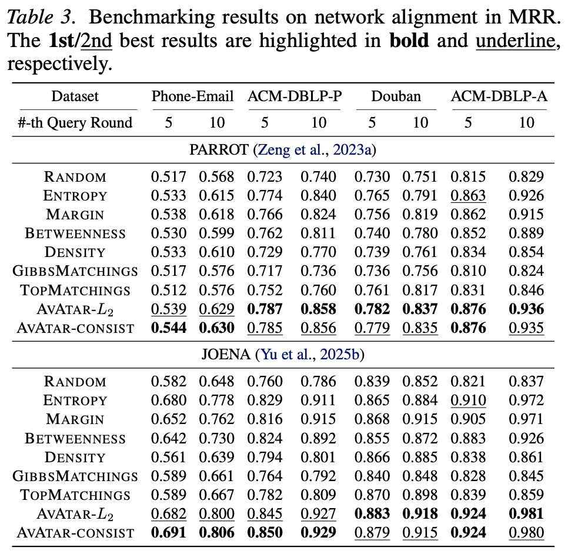
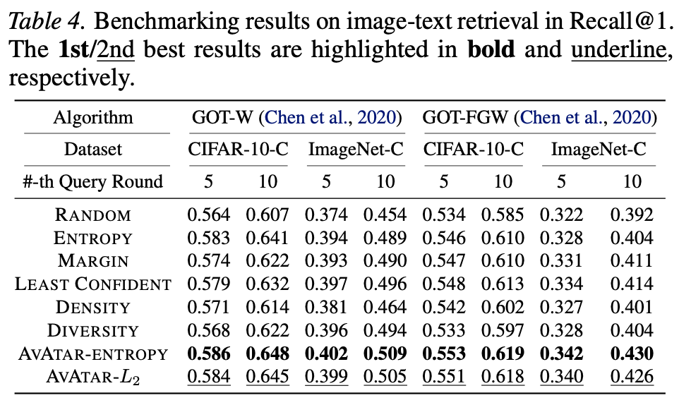
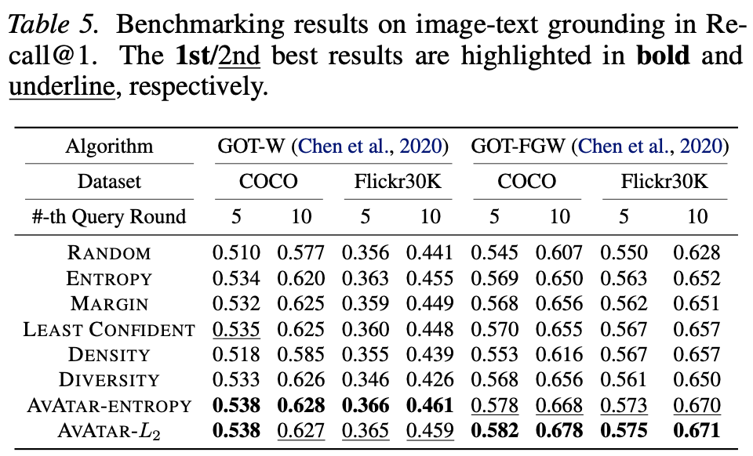
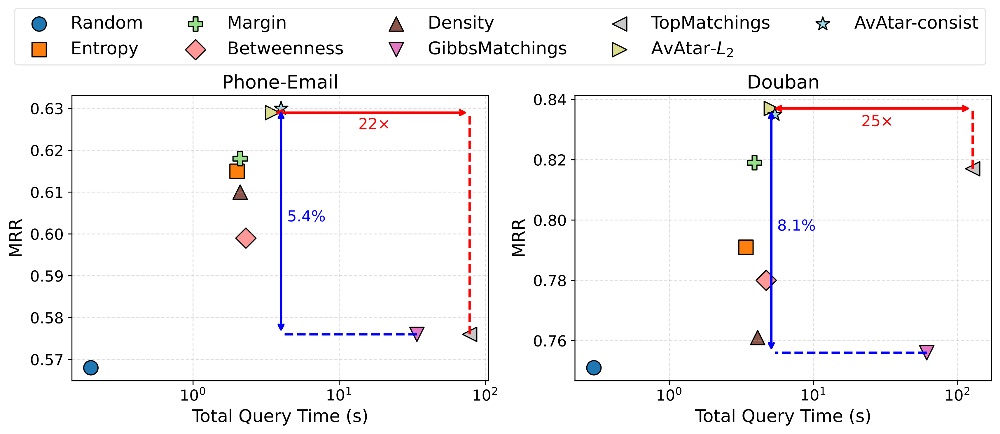
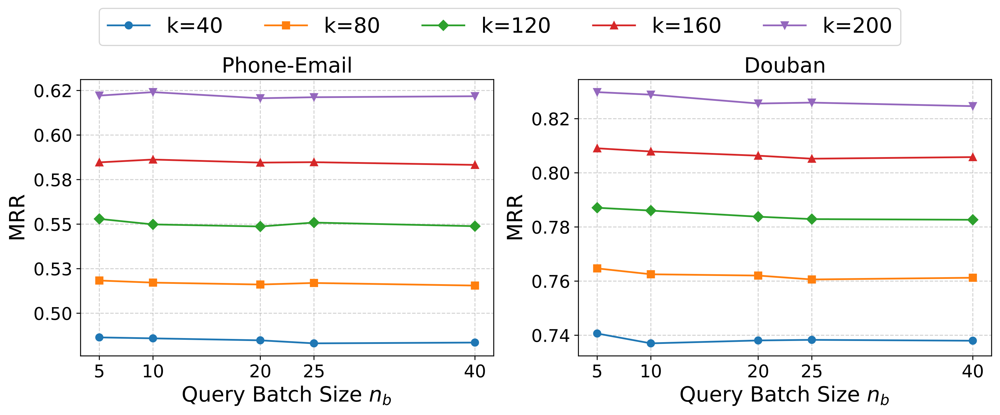
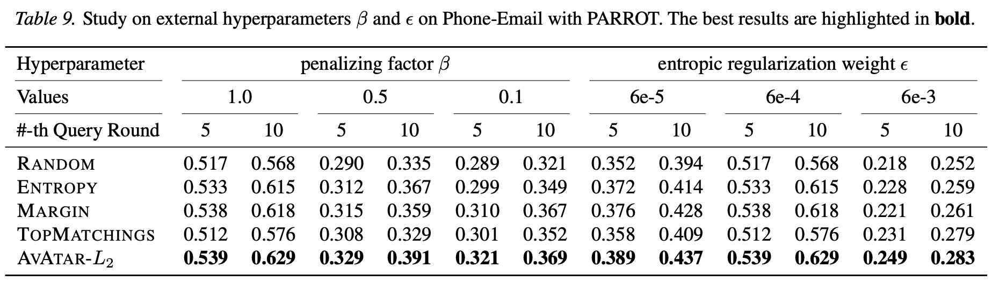

# AvAtar: Learning to Align via Active Optimal Transport

<div align="center">
    <a href="https://github.com/yq-leo">
    </a>
    <!-- <a href="https://github.com/yq-leo/PlanetAlign/blob/main/LICENSE.txt"></a> -->
    <a href="https://github.com/yq-leo/AvAtar-ICML26/blob/main/LICENSE.txt"></a>
    <a href="https://github.com/yq-leo/PlanetAlign"></a>
</div>

👋 Welcome to the offical repository of AvAtar, an active learning framework for optimal-transport-based alignment algorithms.

---

## Results
### 🚀 SOTA effectiveness across 3 different alignment tasks

<table>
  <tr>
    <td width="50%">
      
    </td>
    <td width="50%">
      
      <br>
      
    </td>
  </tr>
</table>

### ⚖️ Good balance between effectivness and efficieny

<p align="center">
  
</p>

### 💪 Robustness to different parameter settings

<p align="center">
  
</p>

<p align="center">
  
</p>

---

## How to use

### Environment Setup
1. Create a new conda environment using the provided `environment.yml` file:
   ```bash
   conda env create --file environment.yml
   ```

2. Activate the environment:
   ```bash
   conda activate avatar
   ```

### Task1: Network Alignment (NA)

We leverage the [PlanetAlign](https://arxiv.org/abs/2505.21366) library for conducting active learning on network alignment tasks, which features a rich collections of built-in datasets and OT-based methods for NA. Please refer to the [code repository](https://github.com/yq-leo/PlanetAlign) and [documentation](https://planetalign.readthedocs.io/en/latest/) of PlanetAlign for detailed installation and usage guides.

After setting up the PlanetAlign environment, you can run the AvAtar for network alignment using the following command:

```bash
python source/active_na.py
```

### Task2 Image-Text Retrieval (ITR)
We use the [CIFAR10-C](https://zenodo.org/records/2535967) and [ImageNet-C](https://zenodo.org/records/2235448) datasets for image-text retrieval tasks. Please download the datasets and place them under the `data/` directory before running the code.

For the OT-based alignment algorithms, we use the GOT method proposed in [Graph Optimal Transport for Cross-Domain Alignment](https://arxiv.org/pdf/2006.14744). The code for GOT is available at the [official repository](https://github.com/LiqunChen0606/Graph-Optimal-Transport).

After setting up the datasets and the GOT method, you can run the AvAtar for image-text retrieval using the following command:

```bash
python source/active_itr.py
```

### Task3 Image-Text Grounding (ITG)
We use the [COCO](https://cocodataset.org/#home) and [Flickr30K Entities](https://bryanplummer.com/Flickr30kEntities/) datasets for image-text grounding tasks. Please download the datasets and place them under the `data/` directory before running the code.

Similar to the image-text retrieval task, for the OT-based alignment algorithms, we use the GOT method proposed in [Graph Optimal Transport for Cross-Domain Alignment](https://arxiv.org/pdf/2006.14744). The code for GOT is available at the [official repository](https://github.com/LiqunChen0606/Graph-Optimal-Transport).

After setting up the datasets and the GOT method, you can run the AvAtar for image-text grounding using the following command:

```bash
python source/active_itg.py
```

---

## Citation
If you find our work useful for your research, please consider citing AvAtar with the following bibtex:

